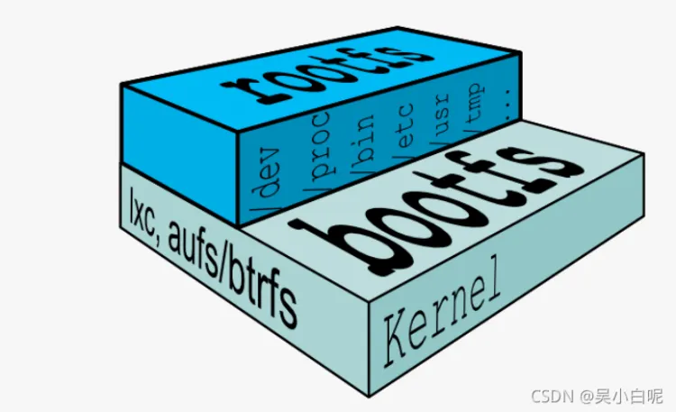
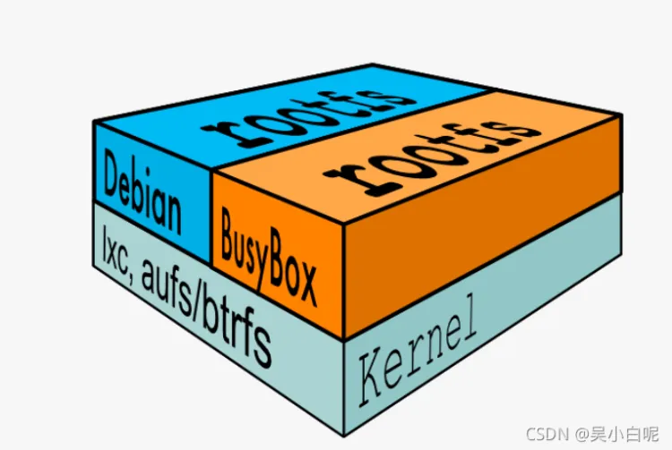
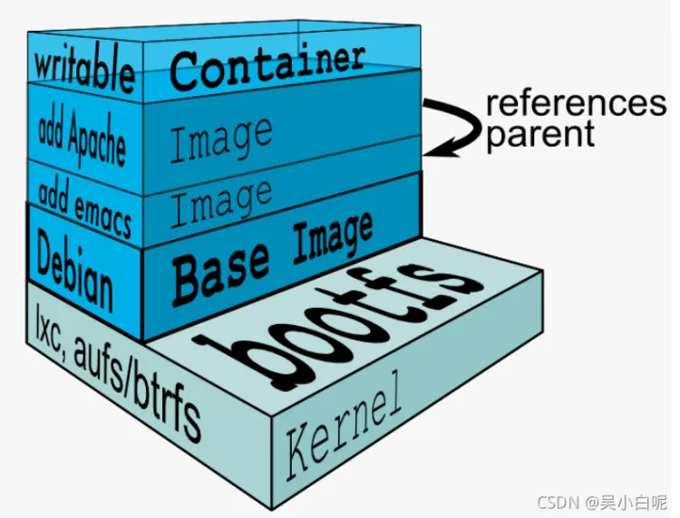
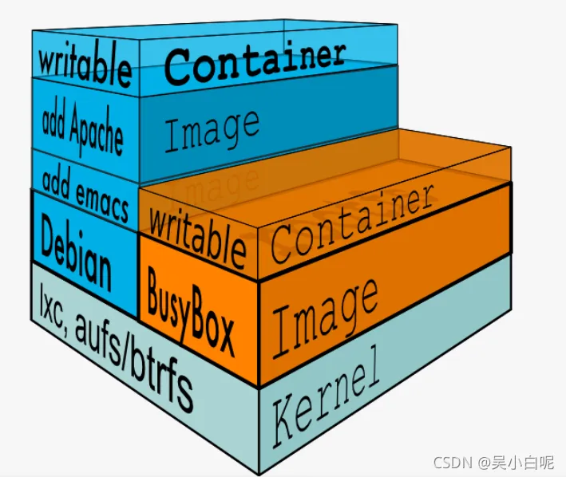

按照官网上的说法，docker的文件系统分为两层:bootfs和rootfs

bootfs包含了bootloader和linux内核。用户是不能对这层作任何修改的。在内核启动之后，bootfs实际上会unmount掉。 

rootfs则包含了一般系统上的常见目录结构，类似于/dev, /proc, /bin等等以及一些基本的文件和命令。

上图中，aufs (advanced multi layered unification filesystem),是一种可堆叠的文件系统。

对于linux上不同版本的问题，docker可以同时运行多个rootfs.

Docker的文件系统是分层的，它的rootfs在mount之后会转为只读模式。 Docker在它上面添加一个新的文件系统，来达成它的只读。

事实上，从下图中，我们能看到多个只读的文件系统，image是只读的，container部分则是可写的。

如果用户想要修改底层只读层上的文件，这个文件就会被先拷贝到上层，修改后驻留在上层，并屏蔽原有的下层文件。这就是为什么你基于现有镜像build image的时候，镜像会越来越大。

最后一部分是容器(container)， 容器是可读写的。

在系统启动时，Docker会首先一层一层的加载image，直到最先面的base image。而这些image都是只读的。

最后，在最上层添加可读写的一个容器， 这里存放着诸如unique id，网络配置之类的信息。

既然是可读写的，就会有状态。容器共有两种状态：running 和 exited.

用户也可以用docker commit 命令将一个容器压制为image，供后续使用。

